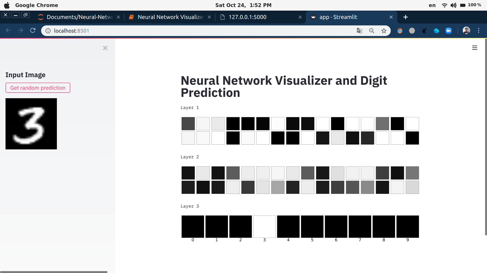
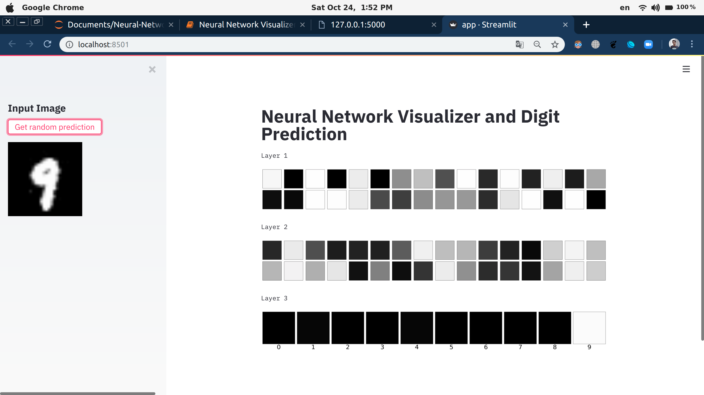
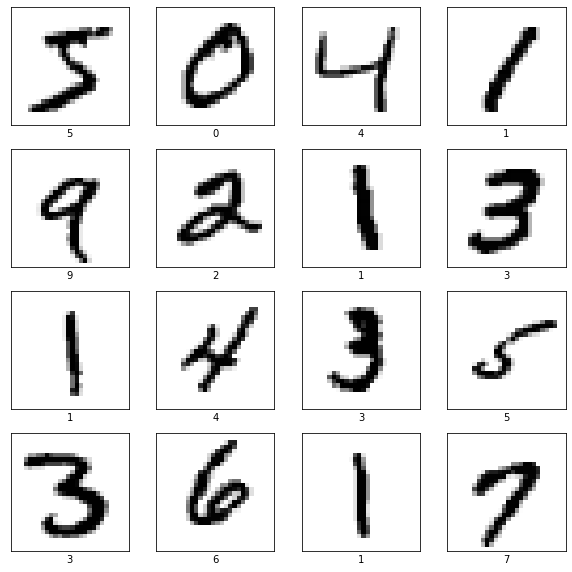

# Neural-Network-Visualizer-And-Digit-Prediction
Creating a Neural Network Visualizer Web App with Python, Streamlit, Keras, and Flask.

------------

## Running the program

* Install the python libraries: `pip install -r requirements.txt`
* Start the flask server using `python model_server.py`.
* While the flask server is running, in a new terminal run streamlit server using `streamlit run app.py`

## Output Preview
-------------





## Code Preview
--------------

## Import Libraries


```python
%matplotlib inline

import tensorflow as tf
import numpy as np
import matplotlib.pyplot as plt
```

## Load Dataset


```python
(x_train, y_train), (x_test, y_test) = \
    tf.keras.datasets.mnist.load_data()
```

## Plot Examples


```python
plt.figure(figsize = (10, 10))

for i in range(0, 16):
    plt.subplot(4, 4, i + 1)
    plt.imshow(x_train[i], cmap = 'binary')
    plt.xlabel(str(y_train[i]))
    plt.xticks([])
    plt.yticks([])
    
plt.show()
```


    

    


## Normalize Data


```python
x_train = np.reshape(x_train, (60000, 28 * 28))
x_test = np.reshape(x_test, (10000, 28 * 28))

x_train = x_train / 255.
x_test = x_test / 255.
```


```python
x_train.shape
```


    (60000, 784)


```python
x_test.shape
```


    (10000, 784)


## Create Neural Network Model


```python
model = tf.keras.models.Sequential(
    [
        tf.keras.layers.Dense(32, activation = 'sigmoid', input_shape = (784, )),
        tf.keras.layers.Dense(32, activation = 'sigmoid'),
        tf.keras.layers.Dense(10, activation = 'softmax')
    ]
)

model.compile(
    optimizer = 'adam',
    loss = 'sparse_categorical_crossentropy',
    metrics = ['accuracy']
)
```


```python
history = model.fit(
    x_train, y_train,
    validation_data = (x_test, y_test),
    epochs = 20,
    batch_size = 512,
    verbose = 2
)
```

    Epoch 1/20
    118/118 - 0s - loss: 1.9650 - accuracy: 0.5476 - val_loss: 1.5543 - val_accuracy: 0.7383
    Epoch 2/20
    118/118 - 0s - loss: 1.2360 - accuracy: 0.7782 - val_loss: 0.9626 - val_accuracy: 0.8234
    Epoch 3/20
    118/118 - 0s - loss: 0.8004 - accuracy: 0.8481 - val_loss: 0.6541 - val_accuracy: 0.8776
    Epoch 4/20
    118/118 - 0s - loss: 0.5777 - accuracy: 0.8816 - val_loss: 0.4961 - val_accuracy: 0.8947
    Epoch 5/20
    118/118 - 0s - loss: 0.4587 - accuracy: 0.8972 - val_loss: 0.4076 - val_accuracy: 0.9063
    Epoch 6/20
    118/118 - 0s - loss: 0.3873 - accuracy: 0.9070 - val_loss: 0.3522 - val_accuracy: 0.9155
    Epoch 7/20
    118/118 - 0s - loss: 0.3400 - accuracy: 0.9143 - val_loss: 0.3151 - val_accuracy: 0.9226
    Epoch 8/20
    118/118 - 0s - loss: 0.3062 - accuracy: 0.9206 - val_loss: 0.2866 - val_accuracy: 0.9276
    Epoch 9/20
    118/118 - 0s - loss: 0.2797 - accuracy: 0.9261 - val_loss: 0.2656 - val_accuracy: 0.9311
    Epoch 10/20
    118/118 - 0s - loss: 0.2589 - accuracy: 0.9312 - val_loss: 0.2484 - val_accuracy: 0.9348
    Epoch 11/20
    118/118 - 0s - loss: 0.2416 - accuracy: 0.9348 - val_loss: 0.2333 - val_accuracy: 0.9362
    Epoch 12/20
    118/118 - 0s - loss: 0.2266 - accuracy: 0.9388 - val_loss: 0.2221 - val_accuracy: 0.9389
    Epoch 13/20
    118/118 - 0s - loss: 0.2141 - accuracy: 0.9415 - val_loss: 0.2118 - val_accuracy: 0.9410
    Epoch 14/20
    118/118 - 0s - loss: 0.2023 - accuracy: 0.9445 - val_loss: 0.2025 - val_accuracy: 0.9444
    Epoch 15/20
    118/118 - 0s - loss: 0.1924 - accuracy: 0.9469 - val_loss: 0.1946 - val_accuracy: 0.9464
    Epoch 16/20
    118/118 - 0s - loss: 0.1833 - accuracy: 0.9489 - val_loss: 0.1870 - val_accuracy: 0.9467
    Epoch 17/20
    118/118 - 0s - loss: 0.1752 - accuracy: 0.9512 - val_loss: 0.1793 - val_accuracy: 0.9491
    Epoch 18/20
    118/118 - 0s - loss: 0.1681 - accuracy: 0.9530 - val_loss: 0.1742 - val_accuracy: 0.9498
    Epoch 19/20
    118/118 - 0s - loss: 0.1611 - accuracy: 0.9550 - val_loss: 0.1692 - val_accuracy: 0.9512
    Epoch 20/20
    118/118 - 0s - loss: 0.1550 - accuracy: 0.9565 - val_loss: 0.1660 - val_accuracy: 0.9519


### Save the Model


```python
model.save('model.h5')
```

## Model Server


```python
%%writefile model_server.py

import json
import random
import numpy as np
import tensorflow as tf

from flask import Flask, request

app = Flask(__name__)

model = tf.keras.models.load_model('model.h5')

feature_model = tf.keras.models.Model(
    model.inputs,
    [layer.output for layer in model.layers]
)

_, (x_test, _) = tf.keras.datasets.mnist.load_data()

x_test = x_test / 255.

def get_prediction():
    index = np.random.choice(x_test.shape[0])
    image = x_test[index, :, :]
    image_arr = np.reshape(image, (1, 784))
    return feature_model.predict(image_arr), image

@app.route('/', methods = ['GET', 'POST'])
def index():
    if request.method == 'POST':
        preds, image = get_prediction()
        final_preds = [p.tolist() for p in preds]
        return json.dumps(
            {
                'prediction': final_preds,
                'image': image.tolist()
            }
        )
    return 'Welcome to the model server!'

if __name__ == '__main__':
    app.run()
```

    Overwriting model_server.py


## Streamlit Web App


```python
%%writefile app.py

import json
import requests
import numpy as np
import streamlit as st
import matplotlib.pyplot as plt

URI = 'http://127.0.0.1:5000/'

st.title('Neural Network Visualizer and Digit Prediction')
st.sidebar.markdown('## Input Image')
st.set_option('deprecation.showPyplotGlobalUse', False)

if st.sidebar.button('Get random prediction'):
    response = requests.post(URI, data={})
    response = json.loads(response.text)
    preds = response.get('prediction')
    image = response.get('image')
    image = np.reshape(image, (28, 28))
    st.sidebar.image(image, width = 150)
    
    for layer, p in enumerate(preds):
        numbers = np.squeeze(np.array(p))
        plt.figure(figsize = (32, 4))
        
        if layer == 2:
            row = 1
            col = 10
        else:
            row = 2
            col = 16
        
        for i, number in enumerate(numbers):
            plt.subplot(row, col, i + 1)
            plt.imshow(number * np.ones((8, 8, 3)).astype('float32'))
            plt.xticks([])
            plt.yticks([])
            
            if layer == 2:
                plt.xlabel(str(i), fontsize = 40)
        
        plt.subplots_adjust(wspace = 0.05, hspace = 0.05)
        plt.tight_layout()
        st.text('Layer {}'.format(layer + 1))
        st.pyplot()
```

    Overwriting app.py
